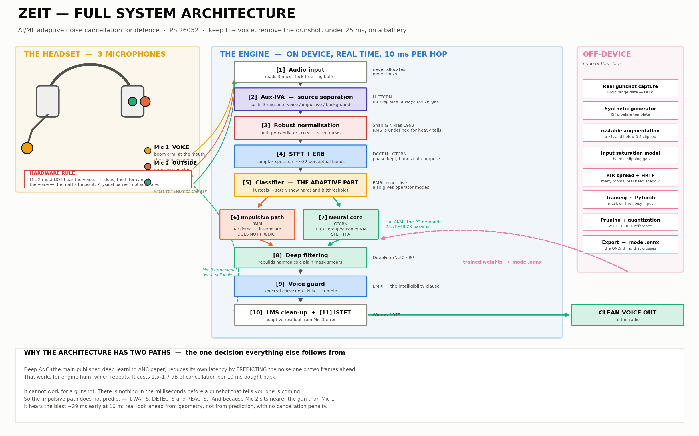
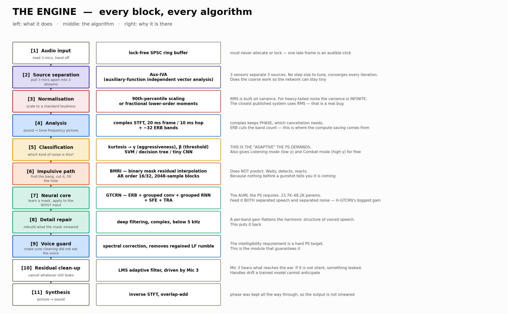

# Software architecture — the ZEIT engine

The product: a **headset that keeps the voice and removes the noise**, running
in real time on a small board.

There is no frontend and no backend here. It is one **engine**: audio goes in
one side, clean voice comes out the other, and every block in between has a
10-millisecond deadline.

This document is about the deployed system only. The range-recording toolkit is
a separate thing and is not part of the product — see
[`../02-data-collection/details.md`](../02-data-collection/details.md) for that.

Written in plain language on purpose. Every algorithm is named, and then
explained.

---

## 1. What the device does

A soldier speaks into a headset while a gun fires nearby. The radio on the
other end should hear **the voice, clearly**, and **not the gunshot**.

That is the whole job. Three things make it hard:

1. **The gunshot is far louder than the voice** — often 40 to 60 dB louder
2. **It arrives with no warning** — you cannot predict a gunshot
3. **It must be done in under 25 milliseconds**, on a battery-powered board

Everything in this architecture exists to solve one of those three.

---

## 2. The headset — 3 microphones



| Mic | Where | What it hears | Job |
|---|---|---|---|
| **Mic 1 — Voice** | Boom arm, near the mouth | Voice, loud. Gunshot, quieter | The signal we want to keep |
| **Mic 2 — Outside** | Outer surface of the earcup | Environment only. Gunshot, loud. Almost no voice | The noise reference |
| **Mic 3 — Inside** | Inside the earcup, next to the ear | What the ear actually hears after the earcup blocks some sound | Tells us how much noise is still getting through |

### Why three and not two

With **two** microphones you can separate **two** things.
With **three** you can separate **three**.

And the problem statement names exactly three kinds of noise: **stationary**
(engine hum), **non-stationary** (wind, vehicles), and **impulsive**
(gunshots). Add the voice, and there are four signals in the room — but the
voice plus the three noise types collapse into three useful streams once the
stationary and non-stationary parts are grouped.

Three microphones is the smallest array that lets **Aux-IVA** (below) pull the
voice, the impulsive noise, and the background apart as separate streams
instead of one mixed mess.

### The rule the hardware team must not break

**Mic 2 must not hear the voice.**

If it does, the system will cancel the voice — not by mistake, but because the
mathematics forces it to. The adaptive filter works by making the total output
as quiet as possible. If the voice appears in the reference microphone, making
the output quiet means removing the voice.

So Mic 2 needs a physical barrier between it and the mouth: the earcup shell,
facing outward, away from the boom. This is a mechanical decision. **Software
cannot fix it afterwards.**

---

## 3. The signal path



```
 Mic 1 (voice) ──┐
 Mic 2 (outside)─┼──► [1] Audio input ──► [2] Aux-IVA ──► [3] Normalise ──► [4] STFT
 Mic 3 (inside) ─┘                                                            │
                                                                              ▼
                                                              ┌──── [5] Classifier
                                                              │         (which kind
                                                              │          of noise?)
                                     ┌────────────────────────┴────────┐
                                     ▼                                 ▼
                          [6] Impulsive path               [7] Neural core
                              BMRI — detect & fill              GTCRN — learned mask
                                     │                                 │
                                     └────────────┬────────────────────┘
                                                  ▼
                                        [8] Deep filtering
                                                  ▼
                                        [9] Voice guard
                                                  ▼
                                       [10] LMS clean-up  ◄── Mic 3 error signal
                                                  ▼
                                          [11] ISTFT ──► clean voice out
```

### [1] Audio input

Reads audio from the three microphones. Runs on its own thread at the highest
priority, does almost nothing, and never waits for anything.

**Why it does nothing:** if this thread is ever late, you hear a click. So it
copies samples into a buffer and hands off. All the real work happens
elsewhere.

### [2] Aux-IVA — separating the sources

**Auxiliary-function-based Independent Vector Analysis.** A classical algorithm
— no neural network, no training.

**What it does in plain terms:** it takes three mixed recordings and pulls them
apart into three separate streams, without being told anything about what the
sources are. It works out, on its own, which parts of the sound move together
and must therefore come from the same source.

**Why the "auxiliary function" version:** ordinary IVA needs a carefully tuned
step size, and if you get it wrong it either converges too slowly for real time
or becomes unstable. The auxiliary-function form has **no step size at all** and
is guaranteed to improve at every iteration. That is what makes it usable on a
device.

**Where it comes from:** H-GTCRN uses exactly this as a cheap first pass before
its neural network. The result: a very small network is enough, because
Aux-IVA has already done the coarse work.

**What comes out:** three streams — roughly *voice*, *impulsive noise*,
*background*. They are not perfect. Making them perfect is the neural core's
job.

### [3] Robust normalisation — the fix that must come first

Audio has to be scaled to a standard loudness before a model sees it. Everyone
does this with **RMS** — the average energy.

**RMS is the wrong tool here, and not just slightly wrong.**

A gunshot can be 40 dB above the voice. RMS is dominated by the loudest
samples, so the gunshot sets the scale. Divide by that and the voice is
squashed down near zero. Worse, the scale changes depending on whether a
gunshot happened to fall inside the window or not.

There is also a formal reason. Impulsive noise is *heavy-tailed* — rare, very
large values. For heavy-tailed signals the **variance is infinite**. RMS is
built on variance. So RMS is not merely fragile here; it is undefined.

**What we use instead:**

1. **90th-percentile scaling** — take the level that 90% of samples fall below, and scale by that. One spike cannot move it. Simple, and it works
2. **Fractional lower-order moments (FLOM)** — Shao & Nikias, 1993. A statistic built on a power *lower* than 2, which stays finite when variance does not. The principled version

The closest published dual-microphone system uses RMS. This is a real bug in
it, it takes half a day to fix, and everything measured downstream is
meaningless until it is fixed.

### [4] STFT + ERB — turning sound into a picture

**STFT** — Short-Time Fourier Transform. Chops the audio into 20-millisecond
slices and, for each slice, works out how much energy sits at each frequency.
The result is a picture: time across, frequency up.

We keep the **complex** form — both magnitude (how loud) and phase (where in
the wave cycle). Phase matters enormously for cancellation. Throw it away and
you can never subtract one sound from another properly.

**ERB** — Equivalent Rectangular Bandwidth. Instead of hundreds of equal-width
frequency bins, group them into about 32 bands that get wider as frequency
rises, the way the human ear does. Fewer numbers to process, and the ones you
keep are the ones people can actually hear.

This is where most of the compute saving comes from.

### [5] The classifier — the "adaptive" part

A small, fast piece of code that looks at each frame and asks: **is this
steady noise, changing noise, or a sudden bang?**

It measures **kurtosis** — a number that says how "spiky" a signal is. Steady
noise sits near 3. A gunshot goes into the hundreds.

Based on the answer it sets two dials:

- **γ (gamma)** — how aggressively to clean
- **β (beta)** — the detection threshold

**Why this matters:** the problem statement asks for an *adaptive* system. This
is the piece that makes it adaptive. Without it the pipeline is fixed — same
behaviour for a gunshot as for engine hum.

The BMRI paper tunes γ by hand, offline, from a chart. Replacing that with a
live classifier is our change.

**It also gives operator modes for free.** Because γ has a known relationship
to how much gets removed:

| Mode | γ | Behaviour |
|---|---|---|
| **Listening** | low | Gentle. Keeps ambient sound so the wearer stays aware of the surroundings |
| **Combat** | high | Aggressive. Protects the voice through gunfire, accepts losing ambient detail |

### [6] Impulsive path — BMRI

**Binary Mask Residual Interpolation** (Ruhland et al., 2015). Classical, no
neural network, and it is fast.

Two steps:

1. **Split.** A threshold that reacts slowly when sound rises and quickly when it falls separates each block into "probably signal" and "probably noise"
2. **Detect and fill.** An **AR model** (autoregressive — it predicts each sample from the few samples before it) checks the noise part. Where the actual sample is wildly different from the prediction, that sample is an impulse. Those samples are thrown away and **replaced by interpolation** — filled in smoothly from their neighbours

**Why this path exists at all.** Deep ANC — the main published deep-learning
ANC paper — reduces its own latency by **predicting** the noise a frame or two
ahead. That works for engine hum, which repeats. **It cannot work for a
gunshot**, because there is nothing in the milliseconds before a gunshot that
tells you one is coming.

So this path does not predict. It **waits, detects, and reacts**. That is the
single most important architectural decision in the whole system.

Its cost is small by design: 2048-sample blocks, AR order 16 or 32, one pass.

### [7] Neural core — GTCRN

The AI part. **GTCRN** — Grouped Temporal Convolutional Recurrent Network
(ICASSP 2024).

It takes the noisy sound and produces a **mask** — a set of numbers, one per
frequency band per time slice, saying "keep this much of this band". Multiply
the noisy sound by the mask and the noise is gone.

Four tricks make it small enough to run on a headset:

| Trick | What it does |
|---|---|
| **ERB filter bank** | Fewer frequency bands to process |
| **Grouped convolution** | Split the channels into groups and let each group work on its own. Far fewer connections |
| **Grouped RNN** | The same grouping idea applied to the memory part |
| **SFE** — subband feature extraction | Pull features from each frequency region separately |
| **TRA** — temporal recurrent attention | Let the small model focus on the moments that matter |

**Size:** the paper reports **23.7K parameters, 39.6 MMAC/s**. The official
code reports **48.2K parameters, 33.0 MMAC/s** — different accounting. Quote
both. For comparison, the closest dual-mic system is 103K parameters after
pruning.

**One important detail from H-GTCRN's own experiments:** apply the mask to the
**original noisy input**, not to Aux-IVA's cleaned-up output. Aux-IVA introduces
its own distortion; masking the raw signal avoids compounding it.

And feed the network **both** the separated-speech stream **and** the
separated-noise stream. In H-GTCRN's ablation that was the single biggest
improvement — bigger than any architecture change.

### [8] Deep filtering

A coarse mask smears out fine detail. Voiced speech has a harmonic structure —
regular peaks at multiples of the pitch — and a per-band gain flattens it.

**Deep filtering** (DeepFilterNet2, IS³) fixes this. Instead of one gain per
band, it predicts a **small complex filter** that combines several neighbouring
time-frequency points. That rebuilds the harmonic structure a plain mask
destroys.

Applied only below about 5 kHz, because that is where the harmonics live, and
restricting it keeps the cost down.

### [9] Voice guard

After the impulsive path fills in gaps by interpolation, low-frequency rumble
can creep back in. This stage runs a spectral correction that removes it.

**Why it is its own stage and not an afterthought:** the problem statement asks
for speech intelligibility to be *preserved*. This is the module that
guarantees the cleaning never eats the voice. In the BMRI paper it is a step;
here it is a named module with its own test, because it is the safety net for
the requirement judges will actually check.

### [10] LMS clean-up — using Mic 3

**Least Mean Squares** (Widrow, 1975). The classic adaptive filter, and only
about twenty lines of code.

Mic 3 sits inside the earcup and hears **what is left** — the noise that got
through everything. That is an *error signal*: if it is not silent, something
is still leaking.

LMS uses that error to adjust itself, sample by sample, and cancel the leftover.
It handles slow drift — a loose earcup, a changing seal, the wearer moving
their head — that a trained model has no way to anticipate.

Optional. It must earn its latency, and that is a measurement, not an opinion.

### [11] ISTFT

Inverse STFT. Turns the processed picture back into sound, using overlap-add.
Because the complex form was kept throughout, the phase is intact and the
output does not sound smeared.

---

## 4. How the pieces divide across time

The hard rule: **everything must finish within 10 milliseconds per hop.**

| Thread | Priority | Does | Must not |
|---|---|---|---|
| **Audio callback** | Real-time | Reads and writes 128 samples. Pushes into a lock-free ring buffer | Allocate memory, take a lock, log, throw |
| **Processing** | High | The whole chain, blocks [2] to [11] | Overrun 10 ms |
| **Control** | Normal | Metrics, telemetry, mode switching | Touch the signal path |

Two threads for the signal, one for everything else. The processing thread is
separated from the callback so that one slow frame stretches a buffer instead
of dropping audio outright.

**The 10 ms figure is a deadline, not a target.** Miss it and the buffer
underruns, which is heard as a click. Every optimisation decision downstream is
measured against it.

---

## 5. Timing budget

| Stage | Latency |
|---|---|
| Audio in/out buffers (128 samples, both directions) | 5.3 ms |
| STFT — one full 20 ms frame must be collected | 20.0 ms |
| **Total algorithmic latency** | **25.3 ms** |
| Compute available per 10 ms hop | 10.0 ms |

25 ms is inside what radio communication tolerates. It would be too much for
hearing your own voice in the earcup, so that path stays analogue and does not
go through the denoiser.

---

## 6. The innovations, and why each is defensible

| # | What | Why it is ours |
|---|---|---|
| 1 | **Robust normalisation instead of RMS** | RMS is formally undefined for heavy-tailed noise. The closest published system uses it. Half a day to fix, explainable in thirty seconds |
| 2 | **Two paths: predict what you can, react to what you cannot** | Deep ANC's latency trick depends on prediction. Gunshots are unpredictable by definition. Nobody has measured the collapse; the architecture follows from it |
| 3 | **Live classifier tuning γ and β** | BMRI tunes them by hand offline. Making it live is what makes the system genuinely adaptive, which the PS demands |
| 4 | **Three mics with Aux-IVA** | Three sources need three sensors. The PS names three noise classes. This is the smallest array that separates them |
| 5 | **Input-side clipping model** | Deep ANC models the loudspeaker saturating. Nobody models the microphone saturating — even though a 140 dB blast destroys the waveform before any algorithm sees it |
| 6 | **α-stable augmentation, including the clipped range** | The α-stable authors excluded α < 0.5 because clipping ruined their results. For us clipping is the physics. We use the range they threw away, for the reason they threw it away |
| 7 | **Mic 3 as an error signal for LMS** | Closes the loop on what actually reaches the ear, not what the model thinks it removed |
| 8 | **Operator-selectable modes** | γ has a known relationship to suppression, so listening mode and combat mode fall out of the existing dial |

---

## 7. What is still open

| Item | Status |
|---|---|
| **Hardware list** | Not yet supplied. When it arrives, this document gets a section auditing how each part connects to which block |
| **Target board** | Unnamed. Sets the real compute budget |
| **Mic models** | Unknown. Their maximum SPL decides whether Mic 2 survives a close blast |
| **Aux-IVA cost on our geometry** | Must be benchmarked. It is cheap in principle; on three channels at 48 kHz that has to be proved |
| **Clean speech corpus** | Undecided. Blocks training |
| **Whether LMS earns its latency** | Measure it, then decide |

---

## 8. Where the hardware will plug in

*Placeholder — to be filled when the hardware list arrives.*

The audit will cover, for each part:

- Which block it feeds or is fed by
- Sample rate and bit depth through the chain
- Maximum SPL versus expected blast level
- Where the analogue-to-digital conversion happens
- Cable and connector path
- Power draw
- What breaks if it fails
