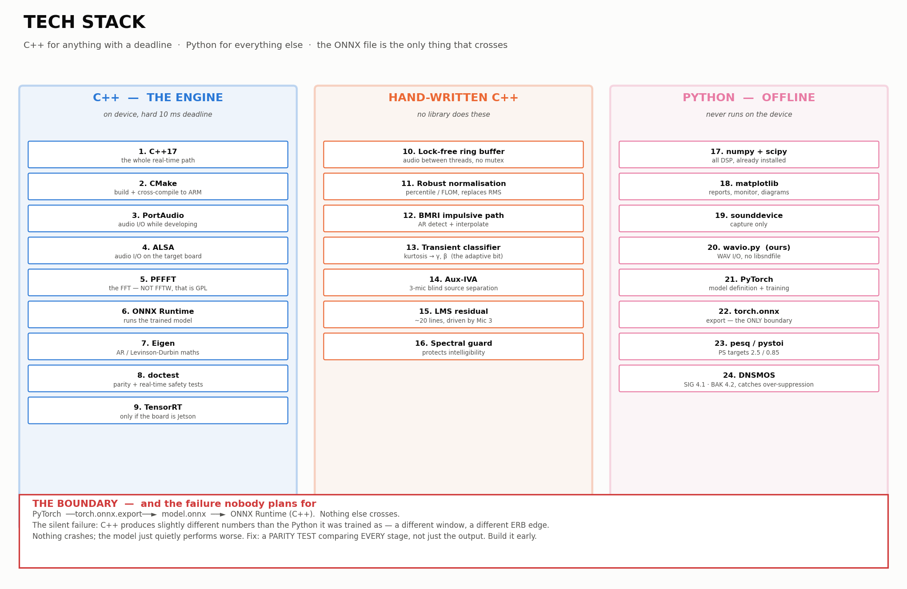

# Tech stack

Two languages, one boundary. **C++ for anything with a deadline, Python for
everything else.**

---



## 0. The list

### C++ — real-time path (runs on the device)

| # | What | For | Licence | Status |
|---|---|---|---|---|
| 1 | **C++17** | The whole real-time signal path. No GC pause, no GIL, no allocator surprises | — | not started |
| 2 | **CMake** | Build, and cross-compiling to ARM without a second build system | — | not started |
| 3 | **PortAudio** | Audio in/out during development — same code on laptop and board | MIT | not started |
| 4 | **ALSA** | Audio in/out on the target board, for lower buffer sizes than PortAudio allows | LGPL | not started |
| 5 | **PFFFT** | The FFT inside STFT/ISTFT. **Not FFTW — that is GPL or paid, a problem for a DRDO deliverable** | BSD-style | not started |
| 6 | **ONNX Runtime** | Running the trained model on the device. The PS names ONNX explicitly | MIT | not started |
| 7 | **Eigen** | Linear algebra for the AR / Levinson-Durbin work in the BMRI path. Header-only, so cross-compiling stays simple | MPL2 | not started |
| 8 | **doctest** or **Catch2** | Unit tests, including the parity test and the real-time safety test | MIT / BSL | not started |
| 9 | **TensorRT** | *Only if* the board turns out to be Jetson. Benchmark against ONNX Runtime before committing | proprietary | conditional |

### Hand-written C++ — no library does these

| # | What | For |
|---|---|---|
| 10 | **Lock-free ring buffer** | Passing audio between the callback thread and the processing thread without a mutex |
| 10b | **Aux-IVA** | Blind source separation across the 3 headset microphones. Splits voice / impulsive / background before the neural core, so the network can stay tiny |
| 11 | **Robust normalisation** | Running percentile / FLOM over a sliding window. Replaces RMS, which is formally invalid for impulsive noise |
| 12 | **BMRI impulsive path** | AR detect + interpolate. A few hundred lines; no library does exactly this |
| 13 | **Transient classifier** | Kurtosis over a window → tunes γ and β. This is the "adaptive" the PS demands |
| 14 | **LMS residual** | Optional final adaptive stage. Textbook, ~20 lines |
| 15 | **Spectral-correction guard** | Removes regained low-frequency rumble after interpolation. The intelligibility safeguard |

### Python — offline (never runs on the device)

| # | What | For | Status |
|---|---|---|---|
| 16 | **Python 3.13** | Everything offline | installed |
| 17 | **numpy** | All array maths, the whole DSP layer | installed |
| 18 | **scipy** | Filters, Welch PSD, resampling, peak finding | installed |
| 19 | **matplotlib** | Reports, quicklooks, the live monitor, the diagrams | installed |
| 20 | **sounddevice** | Recording and the live monitor. The only extra dependency, and only for capture | installed |
| 21 | **our `wavio.py`** | WAV read/write. No libsndfile, so a broken native library cannot strand you at the range. Bit-exact round-trip, verified in the self-test | built |
| 22 | **PyTorch** | Model definition and training. GTCRN and DeepFilterNet reference code is PyTorch | not installed |
| 23 | **torch.onnx** | Export to the ONNX file — the single boundary between Python and C++ | not installed |
| 24 | **pesq** | PESQ metric — PS target > 2.5 | not installed |
| 25 | **pystoi** | STOI metric — PS target > 0.85 | not installed |
| 26 | **DNSMOS** | SIG and BAK separately, so over-suppression becomes visible. Targets SIG 4.1, BAK 4.2 | not installed |

### Not using, deliberately

| # | What | Why not |
|---|---|---|
| 27 | **FFTW** | GPL or commercial licence. Replaced by PFFFT |
| 28 | **libsndfile / soundfile** | A broken native library at the range kills the whole toolkit. Replaced by our own RIFF parser |
| 29 | **librosa** | Heavy, and pulls in dependencies we do not need. numpy + scipy cover it |
| 30 | **An experiment-tracking service** | Everything already writes JSON. Not worth the dependency at this scale |

**Install what is missing:**

```bash
# Python side
python3 -m pip install torch pesq pystoi

# C++ side (macOS)
brew install cmake portaudio eigen onnxruntime
# PFFFT and doctest are single-file — vendor them into engine/third_party/
```

---

## 1. The split

| Layer | Language | Why |
|---|---|---|
| Range data collection | **Python** | Offline. Already built — 16 tools, self-tested |
| Dataset generation | **Python** | Offline, numpy/scipy heavy |
| Model training | **Python** — PyTorch | The whole ecosystem lives here |
| Export | **Python → ONNX** | The bridge. PS names ONNX explicitly |
| **Real-time inference** | **C++17** | Hard deadline. No GC pause, no GIL, no allocator surprises |
| Evaluation and plots | **Python** | Offline |

**The boundary is the ONNX file.** Python produces it, C++ consumes it, and
nothing else crosses. That single rule keeps the two halves from entangling.

Everything on the Python side can be as heavy as it likes — it never runs on
the device. This is the same distinction as in
[`placement.md`](placement.md): off-device shapes the weights, on-device runs
them.

---

## 2. Latency budget — this fixes every other decision

At 48 kHz:

| frame | hop | STFT latency | I/O buffer | total algorithmic | compute budget |
|---|---|---|---|---|---|
| 32 ms | 16 ms | 32.0 ms | 10.7 ms | 42.7 ms | 16.0 ms/hop |
| **20 ms** | **10 ms** | **20.0 ms** | **5.3 ms** | **25.3 ms** | **10.0 ms/hop** |
| 10 ms | 5 ms | 10.0 ms | 5.3 ms | 15.3 ms | 5.0 ms/hop |
| 8 ms | 4 ms | 8.0 ms | 2.7 ms | 10.7 ms | 4.0 ms/hop |

**Chosen: 20 ms frame, 10 ms hop, 128-sample I/O buffer → 25.3 ms algorithmic
latency, 10 ms of compute per hop.**

Three reasons:

1. **It matches Tan et al.'s frame size**, so latency and MMAC comparisons against the closest prior work are like-for-like rather than approximate
2. **25 ms sits inside the radio-comms tolerance.** Own-voice sidetone would want lower, but that is a separate signal path and does not have to go through the denoiser
3. **10 ms of compute is comfortable.** Tan et al. report 2.78 ms per 20 ms frame on an i7 — a real-time factor of 0.14. A GTCRN-class model is far smaller

**The 10 ms compute budget is a hard deadline, not a target.** Overrun it and
the audio callback underruns, which is heard as a click. Every optimisation
decision downstream is measured against this number.

---

## 3. C++ — the real-time path

### 3.1 Libraries

| Need | Choice | Licence | Why this one |
|---|---|---|---|
| **Audio I/O** | **PortAudio** for development, **ALSA** direct on the target | MIT / LGPL | PortAudio is cross-platform so the same code runs on the laptop and the board. Drop to ALSA on the target for lower buffer sizes |
| **FFT** | **PFFFT** (or KissFFT) | BSD-style | **Deliberately not FFTW.** FFTW is GPL or paid — a licensing problem for a defence deliverable. PFFFT is single-file, BSD, SIMD-accelerated, and fast enough at these sizes |
| **Neural inference** | **ONNX Runtime** | MIT | The PS names ONNX and TensorRT. ONNX Runtime runs everywhere including ARM; TensorRT only if the board turns out to be Jetson |
| **Linear algebra** | **Eigen** (header-only) | MPL2 | For the AR/Levinson-Durbin work in the BMRI path. Header-only means no link-time headaches when cross-compiling |
| **Build** | **CMake** | — | Cross-compilation to ARM without a second build system |
| **Testing** | **Catch2** or **doctest** | BSL / MIT | Header-only, so the test build is not its own project |

**Licence is a real constraint here, not a formality.** A GPL dependency in a
DRDO deliverable is a conversation nobody wants. Everything above is
permissive.

### 3.2 What is hand-written, not a library

| Block | Why no library |
|---|---|
| **BMRI impulsive path** | AR modelling, Levinson-Durbin, interpolation. A few hundred lines, and no library does exactly this |
| **Robust normalisation** | Running percentile / FLOM over a sliding window. Trivial, and it must be allocation-free |
| **Transient classifier** | Kurtosis over a window plus a small decision rule. Tiny |
| **LMS residual** | Textbook, twenty lines |
| **Ring buffers** | Lock-free single-producer single-consumer. Must be exactly right; must not allocate |

### 3.3 Real-time rules — non-negotiable in the audio callback

- **No allocation.** Every buffer preallocated at start-up
- **No locks.** Lock-free ring buffer between the audio thread and anything else
- **No exceptions, no I/O, no logging** in the callback path
- **No `std::vector` growth, no `std::string`, no `new`**
- Fixed-size arrays and preallocated scratch space only

Violating any of these produces a click that appears once every few minutes and
is almost impossible to debug afterwards.

### 3.4 Threading

```
  audio callback thread   ── real-time priority
      reads 128 samples, writes 128 samples
      pushes to / pops from lock-free ring buffers
                │
                ▼
  processing thread       ── high priority, not real-time
      accumulates a 20 ms frame
      runs: normalise → STFT → classify → [neural | BMRI] → guard → ISTFT
      must finish inside 10 ms
                │
                ▼
  control thread          ── normal priority
      metrics, logging, telemetry. Never touches the signal path
```

Two threads for the signal, one for everything else. The processing thread is
separated from the callback so that a single slow frame stretches a buffer
rather than dropping audio outright.

---

## 4. Python — everything offline

| Need | Choice | Notes |
|---|---|---|
| **Training** | **PyTorch** | GTCRN and DeepFilterNet reference implementations are PyTorch |
| **Export** | `torch.onnx.export` | Opset pinned; the pin is part of the build |
| **Audio DSP** | **numpy + scipy** | Already the toolkit's only dependencies |
| **WAV I/O** | **our `wavio.py`** | No libsndfile. Bit-exact round-trip, verified in the self-test |
| **Recording** | **sounddevice** | Only for capture and the live monitor |
| **Plots** | **matplotlib** | Reports and diagrams |
| **Metrics** | `pesq`, `pystoi`, DNSMOS | Evaluation only |
| **Experiment tracking** | plain JSON + CSV | Everything already writes JSON. A tracking service is not worth the dependency at this size |

The Python side already exists and passes its own self-test. It does not change.

---

## 5. The boundary — and the failure mode nobody plans for

```
   PyTorch model  ──torch.onnx.export──►  model.onnx  ──►  ONNX Runtime (C++)
```

**The silent failure:** the C++ implementation produces slightly different
numbers from the Python one it was trained as. Different FFT scaling, a
different window, a different ERB band edge, a mismatched normalisation
constant. Nothing crashes. The model just quietly performs worse than it did in
training, and you spend a week blaming the model.

**The fix is a numerical parity test, built early and kept in CI:**

1. Fix a small set of input WAVs
2. Run the full Python pipeline, dump every intermediate — after normalisation, after STFT, after the model, after ISTFT
3. Run the C++ pipeline on the same inputs, dump the same points
4. Assert agreement to a stated tolerance at **every** stage, not just the output

Stage-by-stage matters. If only the final output is compared, a normalisation
error and an inverse-STFT error can cancel out on the test file and diverge
everywhere else.

**Build this before the C++ path is finished, not after.**

---

## 6. Repository layout

```
V_1/
  data_collection/          Python — range toolkit (built)
  docs/                     documentation
  DATA/                     recordings (gitignored)

  training/                 Python — new
      datasets/             mixing, augmentation, α-stable
      models/               GTCRN-class definition
      train.py
      export_onnx.py
      evaluate.py

  engine/                   C++ — the real-time engine
      CMakeLists.txt
      third_party/          vendored single-file deps
          pffft/            FFT (BSD)
          doctest/          tests (MIT)
      include/zeit/         public headers
      src/
          00_core/
              ring_buffer.h     lock-free SPSC — no allocation, ever
              scratch.h         preallocated working memory
              config.h          frame 20 ms, hop 10 ms, 48 kHz — one place
          01_io/
              audio_io.cpp      PortAudio (dev) / ALSA (target)
              mic_array.cpp     3-channel input, per-channel gain, alignment
          02_analysis/
              normalise.cpp     percentile / FLOM — replaces RMS
              stft.cpp          PFFFT wrapper, window, overlap-add
              erb.cpp           ~32 perceptual bands
          03_separation/
              auxiva.cpp        3-mic blind source separation
          04_decide/
              classifier.cpp    kurtosis → γ, β  (the adaptive element)
          05_paths/
              bmri.cpp          impulsive: AR detect + interpolate
              inference.cpp     stationary: ONNX Runtime wrapper
              deepfilter.cpp    harmonic detail rebuild
          06_protect/
              guard.cpp         spectral correction — intelligibility
              lms.cpp           residual, driven by the in-ear mic
          07_pipeline/
              pipeline.cpp      wires 00–06 together
      tests/
          parity_test.cpp   §5 — the stage-by-stage comparison
          rt_safety_test.cpp   asserts no allocation in the callback

  tools/
      bench.cpp             per-block timing on the target board
```

---

## 7. Measuring, on the actual board

Three numbers, none of which the literature reports together:

| Number | How |
|---|---|
| **ms per frame** | `bench.cpp`, per block, worst case over a long run — not the mean. The 99th percentile is what causes clicks |
| **MMAC/s** | Counted from the model graph, cross-checked against measured time |
| **Watts** | USB power meter, idle vs running. **Nobody in the papers reports this** |

Report the **worst-case** frame time, not the average. A mean of 3 ms with
occasional 12 ms spikes fails a 10 ms deadline, and a mean hides that
completely.

---

## 8. Build order

| Step | What | Why this order |
|---|---|---|
| 1 | C++ skeleton: audio in → ring buffer → audio out, passthrough | Proves I/O, buffer sizes and the real deadline before any DSP exists |
| 2 | `rt_safety_test` | Catch allocations in the callback while the code is still small |
| 3 | STFT → ISTFT, perfect reconstruction | If this is not bit-accurate, nothing after it can be trusted |
| 4 | Parity harness (§5) with just the STFT stage in it | Establishes the pattern before there is much to compare |
| 5 | Robust normalisation, both sides | The one fix that must exist before any measurement means anything |
| 6 | ONNX Runtime with a dummy model | Proves the export path and measures inference cost with a placeholder |
| 7 | BMRI path in C++ | Independent of the model; can be built in parallel with training |
| 8 | Real model, full parity, benchmark | Everything meets here |

**Steps 1–4 need no trained model and no range data.** They can run in parallel
with training and with the range trip, and they answer the riskiest question
early: does the deadline hold on the real board at all.

---

## 9. The decisions, and what would change them

| Decision | Reason | Revisit if |
|---|---|---|
| 20 ms / 10 ms frame | Matches Tan et al., fits radio comms | Own-voice monitoring turns out to need the denoised path |
| C++17, not C | Eigen, RAII, `constexpr` — no runtime cost | Target toolchain is stuck on an older compiler |
| PFFFT over FFTW | Licence | The board ships a vendor FFT that is much faster |
| ONNX Runtime | PS names it; runs on ARM | The board is Jetson — then TensorRT is worth benchmarking |
| PortAudio for dev | Same code on laptop and board | Buffer sizes on the target are not achievable through it — drop to ALSA |
| Two signal threads | Isolates the callback from a slow frame | The model turns out fast enough to run in-callback |
| Plain JSON tracking | Everything already writes JSON | The experiment count grows past a few hundred |
