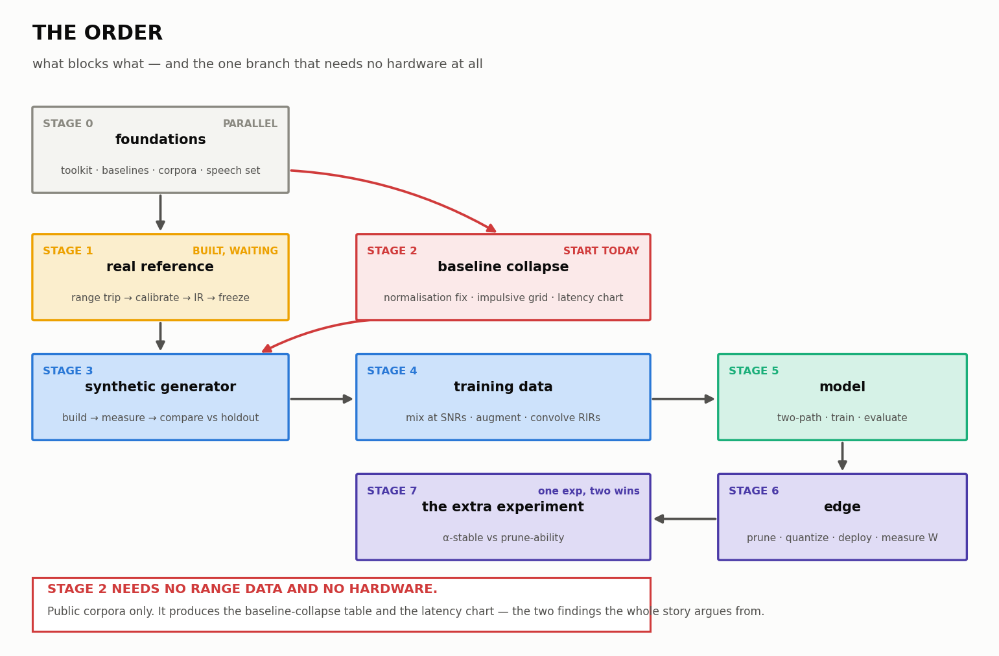

# The order — what happens first, and where each piece plugs in

Read [`WORKFLOW.md`](WORKFLOW.md) for *why* each choice was made. This document
is only about **sequence**: what comes first, what it produces, what cannot
start until it exists.

Status is honest: **BUILT**, **READY TO START**, **BLOCKED**, or **NOT STARTED**.

---

## The loop, in one picture



```
  STAGE 0  foundations ─────────────────────────┐
  (nothing depends on anything)                 │
      0a toolkit          BUILT                 │
      0b baselines        READY TO START        │
      0c noise corpora    READY TO START        │
      0d speech corpus    BLOCKED — undecided   │
                                                │
  STAGE 1  real reference ◄── needs 0a          │
      range trip → calibrate → IR → measure → FREEZE
                          │                     │
                          │                     │
  STAGE 2  baseline collapse ◄── needs 0b+0c ───┘
      normalisation fix → impulsive grid → latency chart
                          │
                          │  ◄── this is the finding the story rests on
                          │
  STAGE 3  synthetic generator ◄── needs 1 + 2
      build → measure with the SAME engine → compare vs holdout
                          │
                          ▼   dataset-quality claim proven here
  STAGE 4  training data ◄── needs 3 + 0d
      mix at SNRs → augment → convolve with RIRs
                          │
  STAGE 5  model ◄── needs 4
      two-path architecture → train → evaluate on the grid
                          │
  STAGE 6  edge ◄── needs 5
      prune → quantize → deploy → measure MMAC, latency, WATTS
                          │
  STAGE 7  the extra experiment ◄── needs 6
      α-stable vs prune-ability
```

**Stage 2 does not wait for the range trip.** It needs only public data. It can
start today and it produces the two findings the whole project argues from.

---

## Stage 0 — Foundations

Nothing here depends on anything else. All four can run in parallel.

### 0a. Real-data collection toolkit — **BUILT**

| | |
|---|---|
| **Produces** | 16 CLI tools, self-test, run sheet, playback signals |
| **Where it plugs in** | Stage 1 uses it end to end |
| **Status** | Done. Self-test green. Waiting only on the microphone |
| **Docs** | [`DETAILS.md`](DETAILS.md), [`README.md`](README.md) |

### 0b. Baseline reproduction — **READY TO START**

| | |
|---|---|
| **Do** | Get GTCRN and DeepFilterNet2 running from their official implementations. Reproduce one published number each |
| **Produces** | A working baseline you can attack in Stage 2 |
| **Where it plugs in** | Stage 2 evaluation grid; Stage 5 compares against it |
| **Blocked by** | Nothing |
| **Why first** | Everything in Stage 2 is "run the published method on data it was never tested on". You need the published method running first |

### 0c. Public noise corpora — **READY TO START**

| | |
|---|---|
| **Do** | Download DEMAND, MUSAN, UrbanSound8K, NOISEX-92, ESC-50 |
| **Produces** | The stationary and non-stationary half of the noise library |
| **Where it plugs in** | Stage 2 grid, Stage 4 mixtures |
| **Note** | Gunshots come from **our** range trip. Everything else comes from here |

### 0d. Clean speech corpus — **BLOCKED, undecided**

| | |
|---|---|
| **Decision needed** | Which corpus, and how Hindi is covered |
| **Produces** | The clean half of every training pair |
| **Blocks** | Stage 4 entirely |
| **Why it matters** | This single decision sets the training-set size. Nothing downstream can be sized until it is made |

---

## Stage 1 — The real reference

Needs 0a. One trip; nothing here is repeatable.

| Step | Command | Produces |
|---|---|---|
| 1.1 Set up the session | `session.py init --name S1 --out ../DATA` | `DATA/` with plan, run sheet, playback signals |
| 1.2 Calibration tone + SPL meter | `capture.py --type cal --spl-db <reading>` | `_calibration/calibration.json` — **every later level is absolute because of this** |
| 1.3 Noise floor, 60 s, mic covered | `capture.py --name "noise floor"` | The reference every SNR is measured against |
| 1.4 Range impulse response | `capture.py --type ir --inverse ...` | `_ir/` — the range acoustics. **Unrecoverable after you leave** |
| 1.5 Gunshots, per condition | `capture.py --name "air rifle 10m"` | One numbered folder per take, each self-processed |
| 1.6 Mechanical, ambience, speech | `capture.py --name ...` | The quiet sounds the blast buries |
| 1.7 Before packing up | `session.py status ../DATA` | The list of what is still missing, while a re-shoot is possible |
| 1.8 Back home | `session.py backup ../DATA /Volumes/USB` | A verified second copy |
| 1.9 After analysis | `session.py freeze ../DATA` | `REFERENCE.lock` — checksums of the data **and** the measurement engine |

**Output of Stage 1:** `analysis/features.json` per take — the acoustic
signature, 16 metrics, with per-condition mean **and standard deviation**.

**That standard deviation is the tolerance.** Stage 3 is judged against it.
Which is why the sizing rule matters: never below 10 shots per condition, 15
for the core.

---

## Stage 2 — Baseline collapse

Needs 0b and 0c only. **No range data, no hardware.** Start now.

### 2.1 Robust normalisation — half a day

| | |
|---|---|
| **Do** | Replace RMS normalisation with 90th-percentile scaling in the baseline's preprocessing |
| **Produces** | A preprocessing step that is defined for heavy-tailed audio |
| **Why first** | Everything measured downstream is meaningless if preprocessing breaks before the model runs |
| **Where it plugs in** | Front of every experiment from here on, and the front of the deployed system |

### 2.2 The impulsive evaluation grid — days

| | |
|---|---|
| **Do** | Run each baseline over stationary / non-stationary / impulsive noise |
| **Produces** | The table showing where published methods hold and where they fail |
| **Why it matters** | Deep ANC was never tested on impulsive noise; the dual-mic paper was trained and tested **only on babble**. Neither generalisation is known |

### 2.3 Latency vs prediction horizon — days

| | |
|---|---|
| **Do** | NMSE against prediction horizon M, stationary and impulsive on the same axes |
| **Produces** | One chart |
| **Why it matters** | Deep ANC buys latency back by predicting ahead — 1.5 dB lost per 10 ms on *periodic* noise. A gunshot is unpredictable by definition. If the impulsive curve falls off a cliff, that chart is the argument for the whole two-path architecture |

**Output of Stage 2:** the baseline-collapse table and the latency chart. These
are the two findings everything else is built to answer.

---

## Stage 3 — Synthetic generator

Needs Stage 1 (the reference) and Stage 2 (so you know what you are fixing).

| Step | What | Produces |
|---|---|---|
| 3.1 | Build the generator — blast model, range IR convolution, distance/propagation | Synthetic gunshots |
| 3.2 | Measure them with **`analyze.py`, the same engine** | `features.json` for synthetic |
| 3.3 | Compare against the real **holdout** split | Per-band deltas, log-spectral distance |

**The engine must be the same.** If real and synthetic are measured by different
code, part of any difference is a difference in the measuring, and the
comparison proves nothing. `session.py verify` checks that the engine has not
changed since the reference was frozen.

**Compare against the holdout only.** The `split` column was assigned at
planning time, before any data existed. Tuning the generator on all the real
data and then comparing against that same data is circular.

**Output of Stage 3:** the dataset-quality claim — the thing shown to judges.

---

## Stage 4 — Training data

Needs Stage 3 and the 0d decision.

| Step | What | Source |
|---|---|---|
| 4.1 | Mix clean speech with noise across SNRs — include **−12.5 to −2.5 dB**, not just 0 to +20 | H-GTCRN's regime is the one gunfire produces |
| 4.2 | α-stable augmentation, α ≈ 1, multiple separate values | Yuan et al. |
| 4.3 | **Below α = 0.5 and let it clip** | The regime they excluded; our physics |
| 4.4 | Input-side saturation model | The mic-clipping gap nobody covers |
| 4.5 | Structured bursts, not i.i.d. spikes | Real attack/decay envelope |
| 4.6 | Convolve with a wide spread of RIRs — near-anechoic through hard-walled | Deep ANC used one room |
| 4.7 | HRTF-based head shadow, not a flat scalar | Tan et al. used −10..0 dB flat |

---

## Stage 5 — Model

Needs Stage 4.

| Step | What |
|---|---|
| 5.1 | Neural core: GTCRN-class — ERB, grouped conv/RNN, SFE, TRA, complex domain |
| 5.2 | Transient path: BMRI-style AR detect + interpolate |
| 5.3 | The adaptive element: kurtosis classifier tuning γ and β |
| 5.4 | Intelligibility guard: spectral correction after interpolation |
| 5.5 | Optional LMS residual stage |
| 5.6 | Train, then evaluate on the Stage 2 grid |

**Where the two mics plug in:** primary at the mouth inside the mask, reference
on the helmet exterior facing outwards. The reference must contain **zero
components of the wearer's voice** — if it does, the filter is mathematically
incapable of cancelling the speech. That is a mechanical requirement for the
hardware team, not something software fixes later.

---

## Stage 6 — Edge

Needs Stage 5.

| Step | What | Note |
|---|---|---|
| 6.1 | Structured pruning, sparse group lasso, iterative | Whole groups — hardware can skip them; scattered zeros still get multiplied |
| 6.2 | Quantization | The study Tan et al. never did |
| 6.3 | ONNX / TensorRT | Per the PS |
| 6.4 | Measure on the **actual board**: MMAC/s, ms per frame, and **watts** | Nobody in the literature reports power. Bring a USB power meter |

---

## Stage 7 — The extra experiment

Needs Stage 6. One experiment, two deliverables.

Train two identical models — one Gaussian-augmented, one α-stable-augmented —
prune both with the same scheme, plot quality against parameter count. If the
α-stable curve sits above, you have better impulsive robustness *and* better
edge compression from a single training change.

---

# Is the research good — and what is missing

**The research you have is strong.** It covers the full arc: classical
foundations (Widrow, NOISEX-92), the learned-enhancement lineage (Wang & Chen →
DCCRN → FullSubNet → DeepFilterNet2 → GTCRN → H-GTCRN), the two closest prior
systems (Deep ANC, dual-mic DC-CRN), the impulsive-specific work (BMRI, IS³,
α-stable), and — unusually — a gap analysis that names *where each one stops*
rather than just summarising. Most teams will have the summaries and not the gaps.

**But the loop does not close yet.** Eight things are missing. I have not added
any of them; these are named, not filled.

One of the eight — gunshot acoustics — is missing **on purpose**: it is our own
measured contribution rather than a citation. That decision stands; §1 below
covers only the narrow part where measurement alone is not enough.

## The four that actually block something

### 1. Gunshot and blast acoustics — **deliberately ours, measured not cited**

**Team decision:** the gunshot acoustics are our own contribution, measured at
the range. Everything else in the stack comes from published papers; this part
does not, and that is the point — nobody else at SIH will have calibrated,
holdout-split, frozen real gunshot measurements.

That is a genuine USP and the decision stands. But measurement and literature
do different jobs, and three things do not come from measuring:

**a. You cannot sanity-check your own number.** If peak SPL comes out at
118 dB, is that the source or a saturating capsule? `validate.py` catches
clipping, but nothing tells you what an air rifle at 10 m *should* read. Without
one external figure, a judge cannot tell a discovery from an error — and
neither can you.

**b. A generator needs a functional form, not just samples.** Fifteen shots
give fifteen waveforms. Producing *new* plausible gunshots means fitting
parameters to a model. Resampling your own recordings is not a generator. The
toolkit already uses a **Friedlander blast wave** — the standard idealisation —
but it is currently uncited, so the one physical assumption underneath the
whole generator has no source behind it.

**c. Extrapolation beyond the measured envelope.** The generator will be asked
to produce distances you did not record. Measurement alone cannot answer "what
physics did you extrapolate with?"

**So the literature needed here is small, not a review.** Three things:

1. One reference figure for expected peak SPL and duration by source type — a sanity check, not a dependency
2. A citation for the blast-wave functional form already in use
3. Basic propagation (§2 below) so the generator can extrapolate

Get those and the measured data becomes *stronger*, because it can be shown to
agree with — or defensibly differ from — a published expectation. "We measured
it ourselves and it matches the accepted model except above 2 kHz, where our
range's ground reflection does X" is a far better sentence than "we measured it
ourselves."

### 2. Outdoor sound propagation — **nothing**

Your plan records at two distances specifically so the generator can be tested
on propagation. But you have no source on how sound actually propagates
outdoors — spreading loss, air absorption as a function of temperature and
humidity, ground effect.

*Blocks:* Stage 3.1. You are logging temperature and humidity precisely because
they change high-frequency absorption — but you have nothing that says by how much.

### 3. Room impulse response simulation — **nothing**

Stage 4.6 says "convolve with a wide spread of RIRs". You have one measured
range IR. For the spread you need simulated ones, and you have no source on the
method.

*Blocks:* Stage 4.6.

### 4. Clean speech corpus, and Hindi — **nothing**

The PS implies Hindi and English. Your notes mention TIMIT only in passing, as
what someone else used. No corpus is chosen and no Indian-language source is
identified.

*Blocks:* Stage 4 entirely, and it sets the training-set size.

## The four that weaken claims rather than block work

### 5. Whether PESQ and STOI are even valid here

Your entire evaluation rests on PESQ, STOI and DNSMOS. You have **no source on
any of them** — not their definition, not their validation conditions.

This matters more than it sounds. These metrics were developed and validated
under particular conditions. Whether they track human judgement under
*impulsive* noise is a question you should answer rather than assume — and if a
judge asks "does PESQ mean anything for a gunshot?", "we used it because
everyone does" is not an answer.

Worth checking before it becomes a problem, since it is the yardstick every
result is reported against.

### 6. Lombard effect — **nothing**

People raise and change their voice in loud noise. It is a named, measured
effect. Your clean speech corpus will be recorded in quiet; your deployment is
a soldier shouting over gunfire. **The clean half of every training pair may be
the wrong kind of speech.**

Your own range plan already records "speech during live fire + paired quiet
reference" — you are collecting the data for this without having the literature
that explains why it matters.

### 7. Voice activity detection — mentioned, not sourced

The gap analysis proposes a VAD in front to switch behaviours. That is Stage
5.3's job. No source on which VAD, or on VAD under impulsive noise — where a
gunshot could easily be misread as speech onset.

### 8. Quantization method — mentioned as a gap, no source on how

You correctly identify that Tan et al. prune but never quantize, and that
prune-then-quantize ≠ quantize-then-prune. But you have no source on
quantization method for speech enhancement, and enhancement is known to be
sensitive to reduced precision.

*Affects:* Stage 6.2.

## What I would get first

In order, by what unblocks the most:

1. **Three small gunshot-acoustics references** (§1a–c) — not a literature review. A sanity-check figure, a citation for the blast model already in the code, and propagation. This is the smallest item on the list and it hardens the part you are strongest in
2. **Clean speech corpus decision** — unblocks Stage 4 and sizes everything
3. **Outdoor propagation** — makes the two-distance experiment defensible
4. **PESQ/STOI validity** — cheap to check, and it is the yardstick for every number you will report

Items 3, 6, 7, 8 can wait until the stage that needs them.

## One thing to be careful about

The gap analysis is excellent, and it says so itself:

> **Verify before you cite.** If a number in this document disagrees with the
> paper, the paper is right.

> **A gap in the literature is not automatically a good project.** Sometimes
> nobody did a thing because it does not work, or because it does not matter.

Nothing in the notes has been checked against the source PDFs. Before any of it
goes on a slide, open the section and confirm. That includes GTCRN's parameter
count, which your own notes already report **two different ways** — 23.7K in the
paper, 48.2K in the official implementation.
