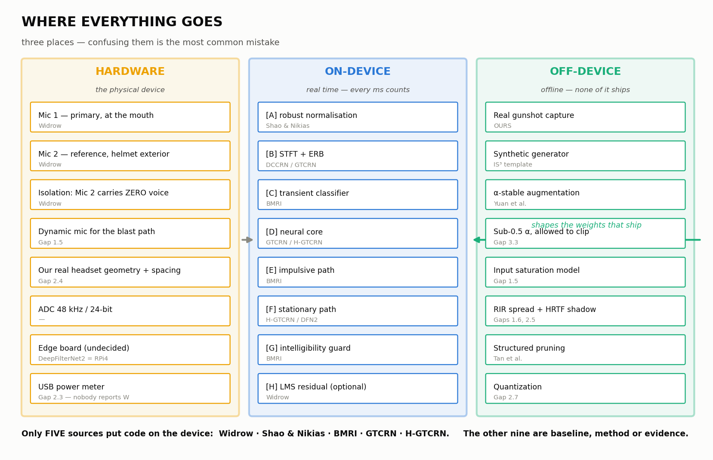
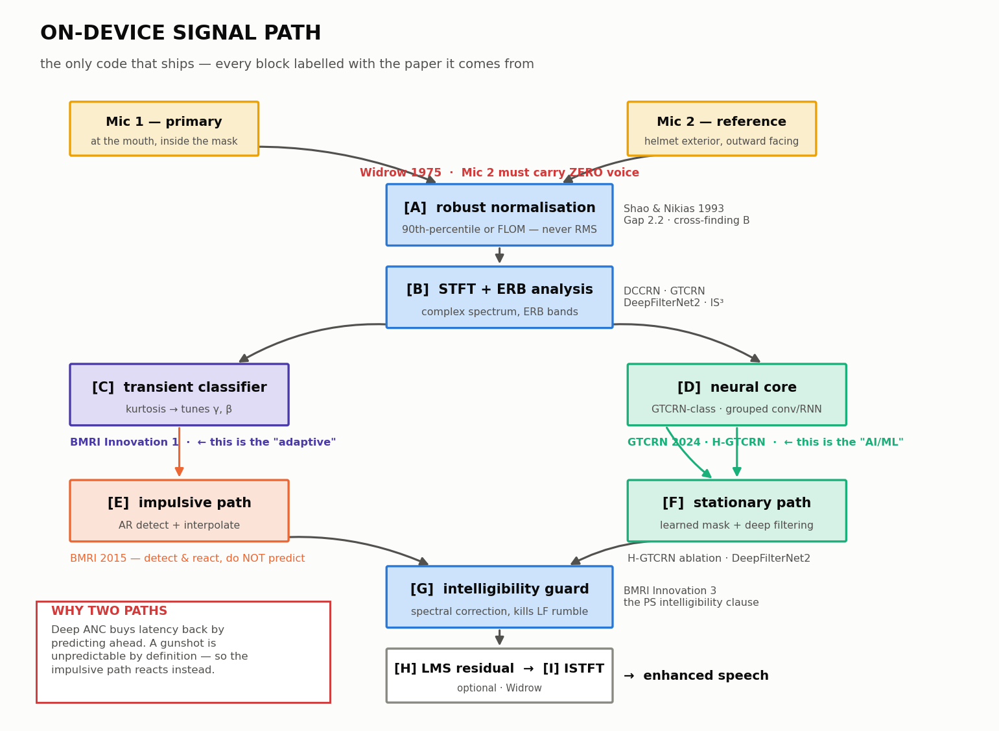

# Where everything goes

Every paper, technique and note mapped to the exact block it lands in.



[`ORDER.md`](ORDER.md) is *when*. [`WORKFLOW.md`](WORKFLOW.md) is *why*. This is
**where** — including which things become hardware, which become code that ships
on the device, and which never leave the training machine.

---

## The one distinction that matters

Three different places, and confusing them is the most common mistake:

| | Runs where | Latency budget | Contains |
|---|---|---|---|
| **HARDWARE** | The physical device | — | Mics, placement, ADC, board |
| **ON-DEVICE** | The board, in real time | **Every millisecond counts** | The signal path only |
| **OFF-DEVICE** | Your training machine, offline | Unlimited | Data generation, training, pruning, evaluation |

α-stable augmentation, the synthetic generator, pruning, every metric — **none
of it ships**. It shapes the weights that ship. A judge asking "isn't that too
heavy for embedded?" about α-stable noise generation has misunderstood the
question, and you should be able to say why in one sentence.

---

## 1. HARDWARE — what physically goes in the device

| Block | Spec | From |
|---|---|---|
| **Mic 1 — primary** | At the mouth, inside the respirator/headset mask. Picks up the vocal command corrupted by gunshot noise | **Widrow** |
| **Mic 2 — reference** | Helmet exterior, facing outwards. Picks up **only** the environment | **Widrow** |
| **Isolation between them** | Mic 2 must contain **zero components of the wearer's voice** | **Widrow** — mathematically, the filter minimises total output power, which forces it to target only the noise. If Mic 2 hears the voice, the system will cancel the voice |
| **Mic type** | Dynamic (moving-coil) for the blast path — no active electronics to overload | **Gap 1.5** — Deep ANC models loudspeaker saturation but nothing models the mic overloading. 140 dB blast vs 110–120 dB capsule limit |
| **Mic spacing** | Our real headset geometry, and tested for robustness to it | **Gap 2.4** — Tan et al. fixed 10 cm and never varied it. A model that works at one spacing fails the first time someone adjusts the headset |
| **ADC** | 48 kHz / 24-bit minimum | Digitek gives an honest 24 kHz bandwidth |
| **Board** | Undecided | **DeepFilterNet2** proves Raspberry Pi 4 real-time. **GTCRN** at tens of thousands of parameters means a Jetson is probably unnecessary |
| **Power meter** | A USB power meter, on the bench | **Gap 2.3** — nobody in the literature reports watts. Free differentiator |

**Hardware team owns rows 1–3 and 5.** Those are mechanical decisions software
cannot fix afterwards.

---

## 2. ON-DEVICE — the real-time signal path

This is the only code that ships. Read top to bottom; that is the signal flow.



```
  Mic 1 ──┐
          ├──►  [A] robust normalisation
  Mic 2 ──┘           │
                      ▼
                [B] STFT + ERB analysis
                      │
          ┌───────────┴───────────┐
          ▼                       ▼
   [C] transient            [D] neural core
       classifier                (GTCRN-class)
          │                       │
    ┌─────┴─────┐                 │
    ▼           ▼                 │
 [E] impulsive  [F] stationary ◄──┘
     path           path
     BMRI AR        learned mask
    interpolate     + deep filtering
    │           │
    └─────┬─────┘
          ▼
   [G] intelligibility guard
          │
   [H] optional LMS residual
          │
   [I] ISTFT ──► enhanced speech
```

| Block | What it does | From | Why here |
|---|---|---|---|
| **[A] Robust normalisation** | Scale on the 90th percentile of magnitude, or a fractional lower-order moment. **Never RMS** | **Gap 2.2 + cross-finding B**; the FLOM tool is **Shao & Nikias (1993)**, cited inside Yuan et al. | RMS is a second moment. For α-stable noise with α<2 the variance is *infinite*. The closest published dual-mic system has a preprocessing step that is formally invalid for our noise class. **Fix this before anything else — everything downstream is meaningless otherwise** |
| **[B] STFT + ERB** | Complex STFT, then compress to ERB bands | **DCCRN** (complex, keeps phase), **GTCRN / DeepFilterNet2 / IS³** (ERB) | Phase matters for cancellation. ERB is perceptually motivated and cuts the band count hard, which is where the compute saving comes from |
| **[C] Transient classifier** | Estimates residual kurtosis, classifies the frame stationary / non-stationary / impulsive, tunes the detection percentage γ and threshold offset β | **BMRI paper's Innovation 1** — the paper hand-tunes γ offline from a kurtosis chart; we replace that with a small live classifier (SVM / decision tree / tiny CNN) | **This is the "adaptive" the PS demands.** Without it the pipeline is fixed, not adaptive |
| **[D] Neural core** | ERB + grouped convolution + grouped RNN + SFE + TRA, complex domain | **GTCRN (ICASSP 2024)**. Dual-mic form from **H-GTCRN**. Full-band + sub-band branches from **FullSubNet** | The smallest architecture with published enhancement results. This is the **AI/ML** the PS requires |
| **[E] Impulsive path** | AR model predicts each residual sample from its neighbours; worst γ% flagged and interpolated back in | **BMRI (Ruhland et al. 2015)** — 2048-sample blocks, AR order 16/32, single pass, no neural component | **Because prediction fails on impulses.** Deep ANC's latency trick predicts ahead; a gunshot is unpredictable by definition. So this path *detects and reacts* instead. Direct consequence of cross-finding A |
| **[F] Stationary path** | Learned mask applied to the **noisy input**, plus deep filtering below 5 kHz for harmonic detail | **H-GTCRN ablation** (mask on noisy input beats mask on separated output), **DeepFilterNet2 / IS³** (deep filtering) | BMRI's own admitted weakness is steady Gaussian noise. That is exactly where the neural core is strong. The two paths are complementary by design |
| **[G] Intelligibility guard** | Spectral correction removing regained low-frequency rumble after interpolation | **BMRI's spectral-correction step**, formalised as its own module (Innovation 3) | The PS demands intelligibility be *preserved*. This is the module that guarantees cleaning never eats the voice |
| **[H] LMS residual** | Optional final adaptive stage | **Widrow** | Cheap, classical, catches what the learned path leaves. Optional — measure whether it earns its latency |
| **[I] ISTFT** | Back to waveform | — | — |

**Which models actually ship:** only **[D] GTCRN-class** and **[E] BMRI**.
Everything else in this table is a technique, not a model.

---

## 3. OFF-DEVICE — data pipeline

None of this runs on the device. All of it shapes the weights that do.

| Step | What | From |
|---|---|---|
| **Real gunshot capture** | 96 kHz/24-bit, staggered gain, calibrated to Pascals, range IR, 9 quality checks, frozen reference | **Ours** — [`DETAILS.md`](DETAILS.md). Not from any paper, deliberately |
| **Synthetic generator structure** | Real + synthetic sources, onset detection to strip impulses from backgrounds, standardised labels | **IS³** — their data-generation pipeline is the template. They faced our exact problem: no standard dataset existed, so they built one |
| **Blast waveform model** | Friedlander wave — sharp rise, positive phase, negative underpressure | **Currently uncited.** Already in `make_test_data.py`. Needs a source (see ORDER.md §1b) |
| **Public noise** | Rotor, vehicle, siren, wind, HVAC | DEMAND, MUSAN, UrbanSound8K, ESC-50, NOISEX-92 |
| **Mixing at SNRs** | Include **−12.5 to −2.5 dB**, not just 0 to +20 | **NOISEX-92** gives the SNR framework; **H-GTCRN** shows that negative range is where gunfire actually lives |
| **α-stable augmentation** | Replace Gaussian augmentation, α ≈ 1, several separate α values (beats blending) | **Yuan et al. (2023)** |
| **Sub-0.5 α, allowed to clip** | Generate below their α floor and let it saturate | **Gap 3.3** — they set α ≥ 0.5 because clipping compromised *their* results. For us clipping **is the physics**. We use the regime they excluded, for the reason they excluded it |
| **Input saturation model** | Saturating function applied to the mic signal in the pipeline | **Gap 1.5** — mirrors Deep ANC's loudspeaker SEF at the opposite end of the chain |
| **Structured bursts** | Heavy-tailed arrival and amplitude, but with a real attack/decay envelope | **Gap 3.6** — their α-stable noise is i.i.d. samples; a real gunshot has structure over tens of milliseconds |
| **γ from SNR** | Derive the dispersion parameter from target SNR instead of sweeping | **Gap 3.5** — they call choosing γ an open problem. In images there is no natural scale; **in audio there is: SNR** |
| **RIR spread** | Near-anechoic (open field) through hard-walled (vehicle interior) | **Gap 1.6** — Deep ANC used one room, 3×4×2 m, T60 0.15–0.25 s, fixed geometry |
| **HRTF head shadow** | Published HRTF data instead of a flat scalar | **Gap 2.5** — Tan et al. scale the secondary channel by a flat −10..0 dB. Real head shadow is strongly frequency-dependent |

---

## 4. OFF-DEVICE — training

| Element | Choice | From |
|---|---|---|
| **Paradigm** | Supervised, noisy/clean pairs | **Wang & Chen (2018)** |
| **Target** | Mask (IRM-family) rather than direct spectrum | **Wang & Chen** |
| **Applied to** | The **noisy input**, not a pre-separated estimate | **H-GTCRN ablation** |
| **Dual-channel conditioning** | Feed **both** separated-speech and separated-noise channels | **H-GTCRN ablation** — the largest single gain in their study |
| **Feature** | Log-power beats full complex for the IVA branch | **H-GTCRN ablation** |
| **Loss** | SI-SNR + L1 on real/imag/magnitude + multi-resolution spectrogram loss | **Tan et al.**, **DeepFilterNet2** |
| **Loss (stretch)** | Fractional lower-order moments | **Cross-finding C** — squared error is ML-optimal for Gaussian residuals; under heavy tails one impulsive sample drags the gradient more than a second of speech. **Stretch goal, must not block anything** |
| **Speech corpus** | **UNDECIDED** | Blocks this whole stage |

---

## 5. OFF-DEVICE — compression

| Step | What | From |
|---|---|---|
| **Structured pruning** | Sparse group lasso, iterative prune-then-finetune. Whole groups, because hardware can skip them; scattered zeros still get multiplied | **Tan et al.** — 290.44K → 103.07K with little quality loss |
| **Quantization** | The study they never did | **Gap 2.7** — note the interaction: prune→quantize ≠ quantize→prune, and enhancement is sensitive to reduced precision |
| **α-stable vs prune-ability** | Two identical models, one Gaussian-augmented one α-stable, prune both, plot quality vs parameter count | **Gap 3.4** — α-stable training produces sparser models (6.16% / 7.13% vs 3.02% on MNIST-C) and they never pruned. **One experiment, two deliverables** |
| **Export** | ONNX / TensorRT | PS requirement |

---

## 6. Evaluation

| Metric | Where it comes from | Target |
|---|---|---|
| SNR / SI-SNR | PS | > 15 dB |
| STOI | PS | > 0.85 |
| PESQ | PS | > 2.5 |
| **NMSE** | **Deep ANC** — their metric, so comparisons are like-for-like | more negative better |
| **DNSMOS SIG** | **Your Notes screenshot** | **4.1** |
| **DNSMOS BAK** | **Your Notes screenshot** | **4.2** |
| Latency, ms/frame | **Gap 2.3** | real-time on our board |
| **Power, watts** | **Gap 2.3** | nobody reports it |

**Why DNSMOS earns its place:** it splits SIG from BAK, so **over-suppression
becomes visible**. If the filter kills the gunshot (high BAK) but drops SIG
below 3.5, it flags that the device is degrading command clarity. A single SNR
number hides that completely — and over-suppression is the exact failure the
PS's intelligibility requirement exists to prevent.

### The two experiments the story rests on

| Experiment | From | Produces |
|---|---|---|
| **Impulsive evaluation grid** | **Gaps 1.1 + 2.1** | Deep ANC was never tested on impulsive noise; Tan et al. trained and tested **only on babble**. Run both on a proper taxonomy and report where they hold and where they break |
| **Latency vs prediction horizon** | **Gap 1.2 + cross-finding A** | One chart, stationary and impulsive on the same axes. Deep ANC loses 1.5–1.7 dB per 10 ms bought back — on *periodic* noise. If the impulsive curve falls off a cliff, that chart justifies the entire two-path architecture |

---

## 7. Every source, and its job

| Source | Job in our system | Ships on device? |
|---|---|---|
| **Widrow (1975)** | Two-mic architecture, mic placement, isolation constraint, LMS residual | **Yes** — [H], and the hardware layout |
| **NOISEX-92 (1993)** | SNR framework, the noise set everyone inherits — and its blind spot | No — evaluation framing |
| **Shao & Nikias (1993)** | Fractional lower-order moments for [A] | **Yes** — [A] |
| **BMRI / Ruhland (2015)** | Impulsive path [E], intelligibility guard [G], adaptive γ [C] | **Yes** — three blocks |
| **Wang & Chen (2018)** | Supervised paradigm, mask targets | No — training method |
| **DCCRN (2020)** | Complex-domain processing in [B] | Concept only |
| **Deep ANC (2021)** | **Baseline to attack.** Its gaps give us 2.1, 2.2, 2.4, 2.8. NMSE metric | No — baseline |
| **Tan et al. dual-mic (2021)** | **Baseline to attack.** Pruning method. Its gaps give us 2.3, 2.5, 2.6, 2.7 | No — baseline + pruning method |
| **FullSubNet (2021)** | Full-band + sub-band structure in [D] | Concept only |
| **DeepFilterNet2 (2022)** | Deep filtering in [F], loss design, embedded feasibility proof | Concept + comparison |
| **Yuan et al. α-stable (2023)** | Augmentation, and the clipping regime we invert | No — training only |
| **GTCRN (2024)** | **The neural core [D]** | **Yes** |
| **H-GTCRN** | Dual-mic form of [D], three ablation findings | **Yes** |
| **IS³ (2025)** | Synthetic data pipeline template, two-stage filtering | No — data method |
| **Our range data** | The reference the generator is validated against | No — but it is what makes the dataset claim real |

**Only five sources put code on the device:** Widrow, Shao & Nikias, BMRI,
GTCRN and H-GTCRN. Everything else is method, baseline or evidence.

That is worth knowing before a judge asks "you listed fourteen papers — which
ones are actually in the product?"
